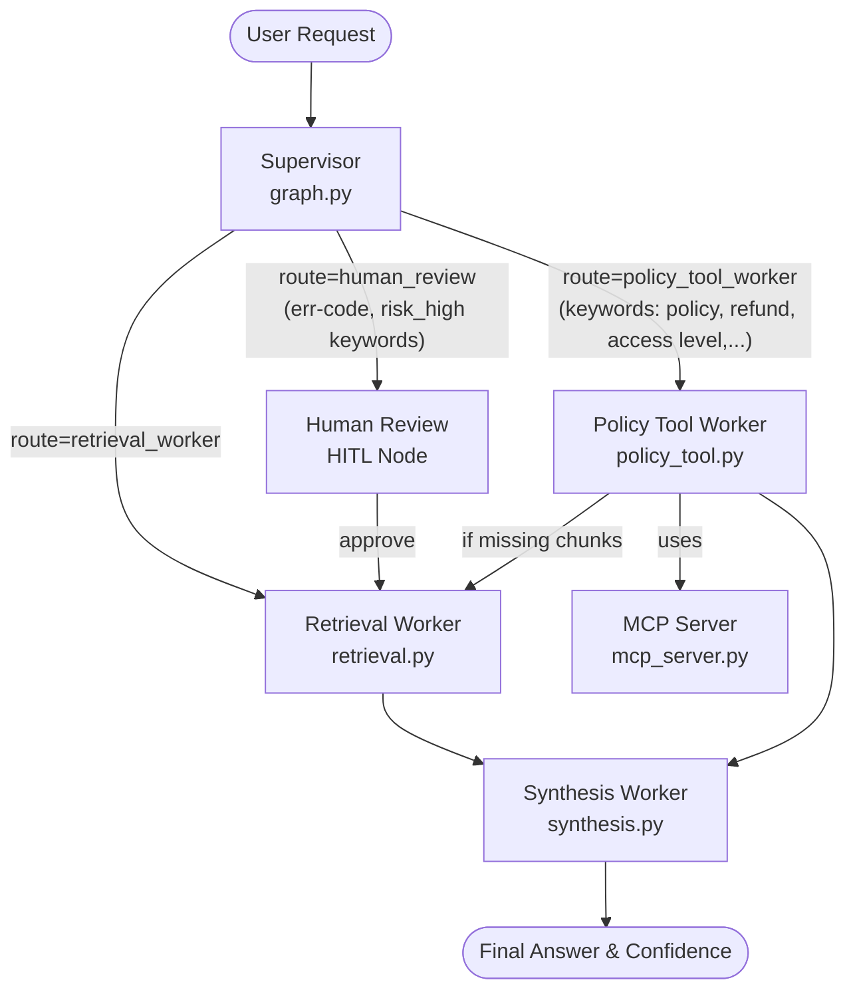

# System Architecture — Lab Day 09

**Nhóm:** X666
**Ngày:** 14/04/2026
**Version:** 1.0

---

## 1. Tổng quan kiến trúc

> Mô tả ngắn hệ thống của nhóm: chọn pattern gì, gồm những thành phần nào.

**Pattern đã chọn:** Supervisor-Worker  
**Lý do chọn pattern này (thay vì single agent):**
- Supervisor-Worker cho phép phân chia rõ trách nhiệm (separation of concerns), tách biệt hoàn toàn luồng phân tích chính sách/quyền truy cập (Policy Check & Tools) khỏi luồng tra cứu thông tin chung (Retrieval).
- Cho phép quản lý và đánh giá ngữ cảnh thực thi ở nhiều mức độ khác nhau: định tuyến theo độ phức tạp hoặc theo mức độ rủi ro của tác vụ, dễ dàng tích hợp Human-in-the-loop (HITL) cho các yêu cầu có rủi ro cao (risk_high).
- Giảm tải cho một mô hình LLM duy nhất, thay vào đó mô hình LLM sẽ hoạt động với context hẹp hơn ở Synthesis Worker, giúp giảm thiểu hallucination cực kì hiệu quả.

---

## 2. Sơ đồ Pipeline

> Vẽ sơ đồ pipeline dưới dạng text, Mermaid diagram, hoặc ASCII art.
> Yêu cầu tối thiểu: thể hiện rõ luồng từ input → supervisor → workers → output.

**Sơ đồ thực tế của nhóm:**

---

## 3. Vai trò từng thành phần

### Supervisor (`graph.py`)

| Thuộc tính | Mô tả |
|-----------|-------|
| **Nhiệm vụ** | Phân tích từ khóa câu hỏi (task) đầu vào của User để định tuyến (route) hệ thống chạy sang Worker phù hợp. |
| **Input** | `state["task"]` (Câu hỏi từ người dùng) |
| **Output** | `supervisor_route`, `route_reason`, `risk_high`, `needs_tool` |
| **Routing logic** | Định tuyến dựa vào Text Matching/Keywords: "hoàn tiền", "quy trình" -> policy_tool_worker; "sla", "ticket" -> retrieval_worker; "err" -> HR. |
| **HITL condition** | Trigger nếu nhận dạng câu hỏi ở tình huống khẩn cấp, "KHÔNG rõ nguyên nhân" hoặc xuất hiện Error Code không xác định. |

### Retrieval Worker (`workers/retrieval.py`)

| Thuộc tính | Mô tả |
|-----------|-------|
| **Nhiệm vụ** | Thực hiện Semantic Search trên vector database (ChromaDB) để trích xuất ra các chunks văn bản đáp ứng yêu cầu. |
| **Embedding model** | Hỗ trợ nhiều lựa chọn: Sentence Transformers (`all-MiniLM-L6-v2`), Open AI `text-embedding-3-small`. |
| **Top-k** | Default = 3 |
| **Stateless?** | Yes |

### Policy Tool Worker (`workers/policy_tool.py`)

| Thuộc tính | Mô tả |
|-----------|-------|
| **Nhiệm vụ** | Phân tích điều kiện policy bằng LLM/Rule-based từ context trả về, gọi MCP tools để lấy thêm real-time context cho quyết định nếu cần. |
| **MCP tools gọi** | `search_kb` (nếu chưa có chunks), `get_ticket_info` |
| **Exception cases xử lý** | Chính sách hoàn tiền về hàng Flash Sale, Sản phẩm Kỹ Thuật Số, Sản phẩm đã kích hoạt. |

### Synthesis Worker (`workers/synthesis.py`)

| Thuộc tính | Mô tả |
|-----------|-------|
| **LLM model** | `gpt-4o-mini` (OpenAI), hoặc `gemini-2.0-flash` (Google GenAI) |
| **Temperature** | 0.1 |
| **Grounding strategy** | LLM-as-a-judge cho điểm tin cậy (Confidence). Nội dung câu trả lời bị ép nghiêm ngặt: Ràng buộc phải dựa trên chunks/exceptions, cite rõ nguồn. |
| **Abstain condition** | Khi context được trả về thiếu hoặc trả lời "Không đủ thông tin" thì Confidence sẽ rơi xuống rất thấp (0.3). |

### MCP Server (`mcp_server.py`)

| Tool | Input | Output |
|------|-------|--------|
| search_kb | `query`, `top_k` | `chunks`, `sources`, `total_found` |
| get_ticket_info | `ticket_id` | `ticket_id`, `priority`, `status`, `assignee`, `created_at`... |
| check_access_permission | `access_level`, `requester_role`, `is_emergency` | `can_grant`, `required_approvers`, `emergency_override`, `notes` |
| create_ticket | `priority`, `title`, `description` | `ticket_id`, `url`, `created_at` (Mocked data) |

---

## 4. Shared State Schema

> Liệt kê các fields trong AgentState và ý nghĩa của từng field.

| Field | Type | Mô tả | Ai đọc/ghi |
|-------|------|-------|-----------|
| task | str | Câu hỏi đầu vào | supervisor đọc |
| supervisor_route | str | Worker được chọn | supervisor ghi |
| route_reason | str | Lý do route | supervisor ghi |
| retrieved_chunks | list | Evidence từ retrieval | retrieval ghi, policy_tool ghi, synthesis đọc |
| retrieved_sources | list | Danh sách file nguồn được rút ra từ ChromaDB | retrieval ghi, synthesis đọc |
| policy_result | dict | Kết quả kiểm tra policy | policy_tool ghi, synthesis đọc |
| mcp_tools_used | list | Tool calls đã thực hiện | policy_tool ghi |
| final_answer | str | Câu trả lời cuối | synthesis ghi |
| confidence | float | Mức tin cậy (score 0-1) tự đánh giá bởi LLM-as-a-Judge | synthesis ghi |
| risk_high | bool | Xác định task có rủi ro cao -> Cập nhật sang HR node | supervisor ghi |
| needs_tool | bool | Báo cho policy_tool biết có cần gọi tools thật hay không | supervisor ghi |
| history / workers_called | list | Tracing log, lưu vết quá trình gọi của Worker / Pipeline | System (All) ghi |

---

## 5. Lý do chọn Supervisor-Worker so với Single Agent (Day 08)

| Tiêu chí | Single Agent (Day 08) | Supervisor-Worker (Day 09) |
|----------|----------------------|--------------------------|
| Debug khi sai | Khó — không rõ lỗi ở đâu | Dễ hơn — test từng worker độc lập |
| Thêm capability mới | Phải sửa toàn prompt | Thêm worker/MCP tool riêng |
| Routing visibility | Không có | Có route_reason trong trace rõ ràng luồng ra quyết định |
| An toàn & Xác thực | Phụ thuộc vào Prompts, dễ bị Prompt Injection bypass | Workflow ép buộc validate qua graph state chặt chẽ |

**Nhóm điền thêm quan sát từ thực tế lab:**
- Kiến trúc Supervisor-Worker yêu cầu ta định nghĩa Graph State cực kỳ rõ ràng và các Workers phải tuân thủ chuẩn Input/Output chặt chẽ (contract-based). Điều này làm cho code overhead ban đầu tăng nhẹ, nhưng lại giải quyết triệt để lỗi Hallucination khi Single Agent phải xử lý quá nhiều tasks hỗn độn cùng lúc.
- Framework dạng Agentic Graph như thế này giúp dễ dàng phân mảnh workload, nơi từng node có thể mở rộng theo quy mô và độ trễ được giám sát cho mỗi node.

---

## 6. Giới hạn và điểm cần cải tiến

> Nhóm mô tả những điểm hạn chế của kiến trúc hiện tại.

1. **Routing Logic cứng ngắc:** Router ở Supervisor hiện đang dùng Rule-based/Regex (if/else bằng Keywords) thay vì được hỗ trợ phân loại linh hoạt bởi Router Assistant/LLM. Nếu số lượng Keyword lớn thì hệ thống sẽ phức tạp và lỏng lẻo.
2. **Human Node sơ khai:** HITL (Human in the loop) đang chỉ được giả lập ở phần Terminal Local theo dạng "Auto-approving in lab mode". Chưa được tích hợp một checkpoint thực thụ (ví dụ Interrupting Stream / Graph).
3. **Mô hình phụ thuộc Confidence của LLM:** Việc sử dụng LLM-as-a-Judge trong Synthesis Worker còn phụ thuộc khá nhiều vào tư duy của Foundation Model (Gemini/GPT-4o), có lúc sẽ sinh ra độ tin cậy bị bias vì nó vừa tạo ra câu trả lời vừa tự làm trọng tài (judge) cho chính câu đó. Có thể cải thiện bằng cách sử dụng một Model độc lập nhỏ hơn chuyên cho Scorer.
